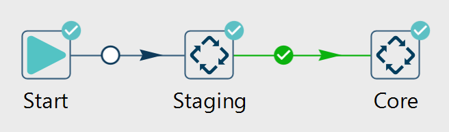
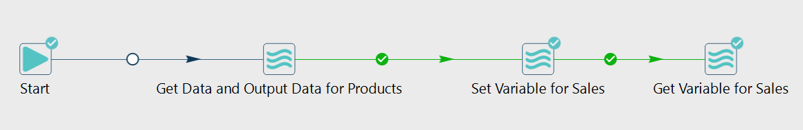
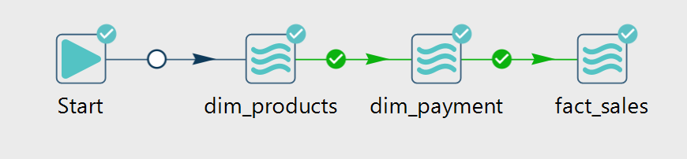
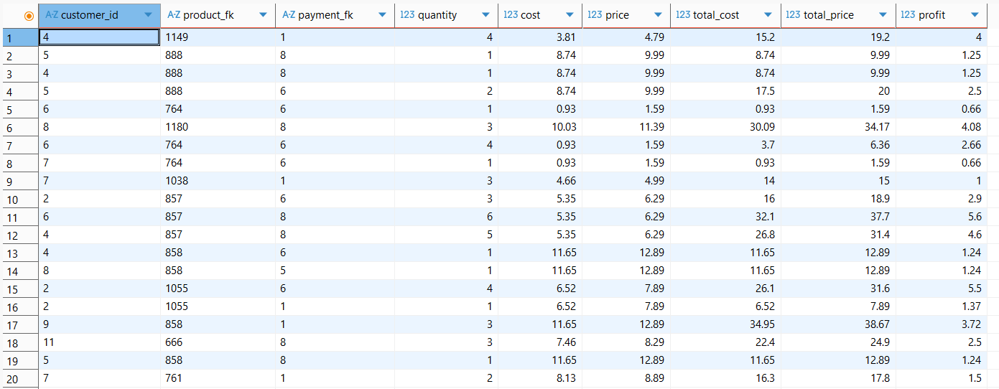

# Sales Data Warehouse with AWS, PostgreSQL and Apache Hop

## Project Overview
This project is an end-to-end sales data warehouse project built using AWS, PostgreSQL, DBeaver, and Apache Hop.
The main goal of this project is to transform raw sales and product data into a structured data warehouse model for analysis and reporting.
The project follows a layered data warehouse architecture with public, staging, and core schemas.
Raw data is first stored in the public schema, transformed in the staging schema, and loaded into the core schema for analytical processing.
The final structure includes dimension tables and a fact table for sales analysis.
Product data is loaded using a full refresh strategy because it is relatively small and less frequently updated.
Sales data is loaded using an incremental load strategy based on the LastLoadDate variable to avoid reprocessing historical transaction records.

## Business Objective
The objective of this project is to build a scalable data warehouse for analyzing sales performance, product performance, payment behavior, and time-based sales trends.

## Tools & Technologies
- AWS
- PostgreSQL
- DBeaver
- Apache Hop
- SQL
- ETL
- Data Warehousing
- Dimensional Modeling
- Star Schema

## Database Architecture
The project uses three schemas:

### Public Schema
Stores raw source data.
Tables:
- products
- sales
- date_dim

### Staging Schema
Stores temporarily transformed data.
Tables:
- stg_products
- sales

### Core Schema
Stores analytical warehouse tables.
Tables:
- dim_products
- dim_payment
- sales (fact table)

## ETL Process
The ETL process was developed using Apache Hop.
Main transformations:
- Product brand splitting into product_name and brand_name
- Data cleaning and trimming unnecessary spaces
- Handling missing payment values with default cash payment
- Loading cleaned data into dimension tables
- Creating fact table relationships

## Data Model
Dimension Tables:
- dim_products
- dim_payment
- date_dim

Fact Table:
- core.sales

The fact table stores transactional sales data and references dimension tables using foreign keys.

## ETL Workflow Screenshots

### Complete ETL Workflow

### Staging Workflow

### Core Workflow

### Fact Sales Pipeline

